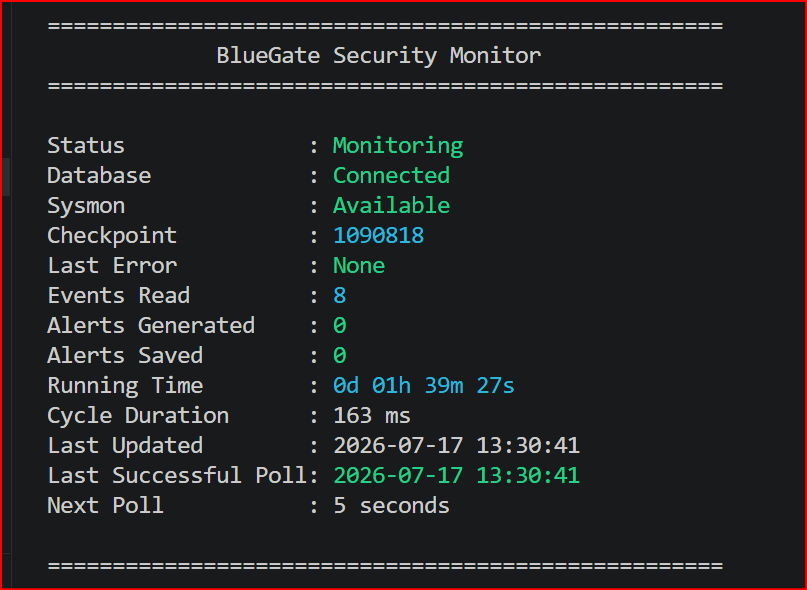

# BlueGate

BlueGate is a Windows-native security monitoring platform designed to provide SIEM-style visibility, detection engineering, alerting, and firewall response capabilities.

The project is intended as both a learning platform and a practical security tool, focusing on Windows telemetry collection, threat detection, and defensive security operations.

## Objectives

BlueGate aims to:

- Collect Windows security telemetry
- Ingest Sysmon events
- Monitor network activity
- Detect suspicious behaviour
- Generate alerts
- Provide incident timelines
- Manage Windows Firewall rules
- Support future gateway and network monitoring capabilities

## Architecture

BlueGate consists of several components:

### BlueGate.Agent

Endpoint telemetry collector.

Responsibilities:

- Read Sysmon events
- Read Windows Event Logs
- Monitor network activity
- Forward events to storage

### BlueGate.Server

Detection and analysis engine.

Responsibilities:

- Event correlation
- Detection rules
- Alert generation
- Incident management

### BlueGate.Web

Management dashboard.

Responsibilities:

- Event search
- Alert review
- Incident investigation
- Firewall administration

### BlueGate.Database

Event storage layer.

Initial implementation:

- SQLite

Future implementation:

- PostgreSQL

## Technology Stack

- C#
- .NET 8
- Sysmon
- Windows Event Logs
- SQLite
- Blazor
- PowerShell
- Windows Defender Firewall

## Development Roadmap

### Phase 1

Telemetry Collection

- Read Sysmon events
- Read Windows Event Logs
- Store events in SQLite

### Phase 2

Detection Engineering

- Rule engine
- Alert generation
- Event correlation

### Phase 3

Dashboard

- Web interface
- Event search
- Alert management

### Phase 4

Response

- Firewall rule management
- Automated blocking
- Incident workflows

### Phase 5

Advanced Features

- Gateway mode
- Network analytics
- Windows Filtering Platform integration

## Project Status

Early development.

Currently implementing telemetry collection through Sysmon and Windows Event Logs.

### 17 July 2026

- Introduced the HealthMonitor component.
- Added the HealthStatus DTO to separate health reporting from monitoring statistics.
- Refactored the Console Dashboard to display HealthStatus information instead of hard-coded values.
- Added the first operator dashboard screenshot.
- Began introducing dependency injection into HealthMonitor.

Implemented BlueGate's first genuine runtime health check. HealthMonitor now
uses AlertRepository to verify SQLite connectivity, and the console dashboard
reports the live database status.

## Console Dashboard

